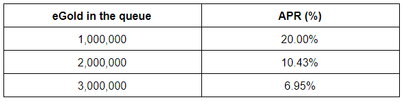
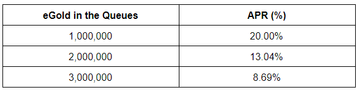
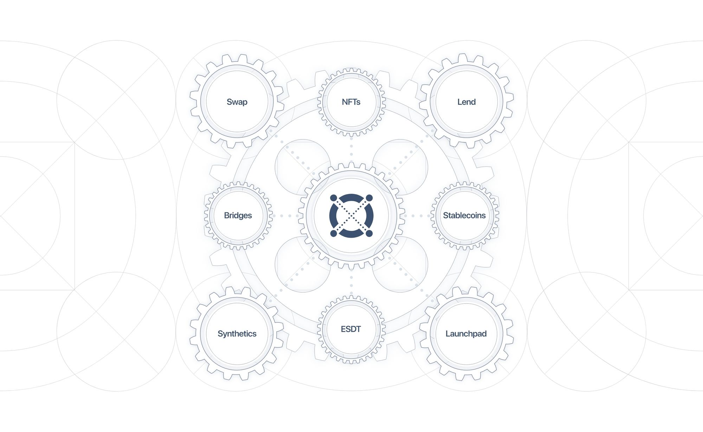
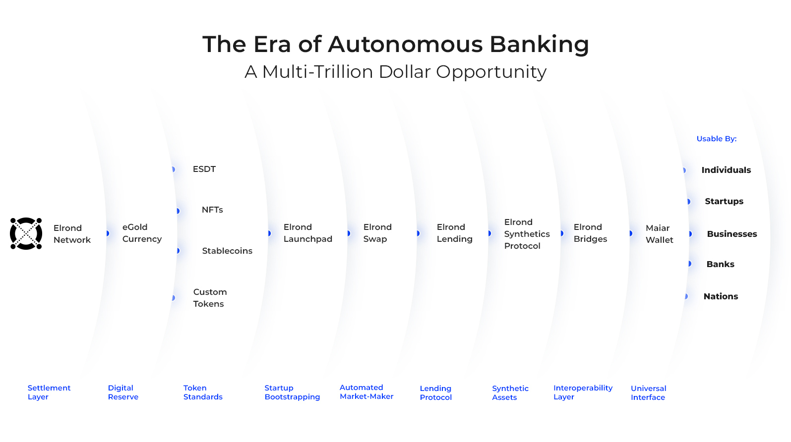
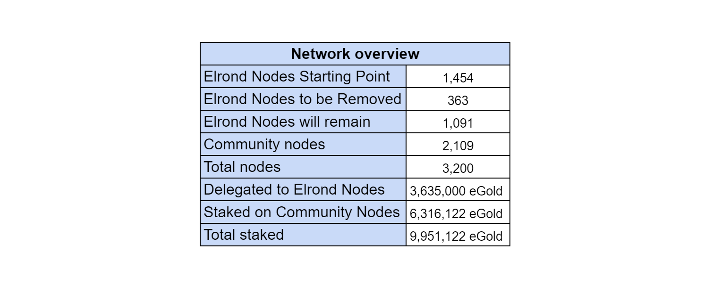
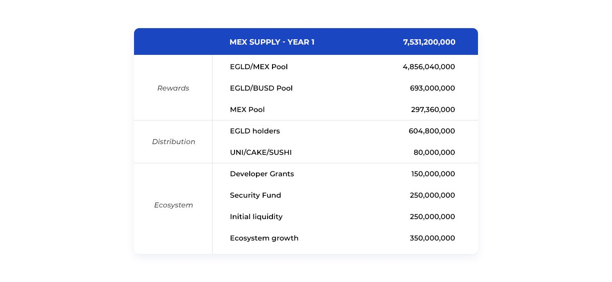

# Elrond Economics Updates

-------

스테이킹 기능의 점진적 활성화는 전체 Elrond 부트스트랩 프로세스의 핵심 부분입니다. 스테이킹은 4 단계로 활성화됩니다.

- Phase 1 - Delegation Waiting List (2020. 10. 14)
- Phase 2 - Validators Queue (2020. 12. 1)
- **Phase 3 - Open Staking (2021. 3. 30)** - Elrond Node를 Community에게 분배
- **Phase 3.5 - Top-up 증가, Validator <-> Staking 병합 지원 (2020. 6월 중)**
- Phase 4 - Advanced Staking features

--------

[toc]

- [Elrond Economics Updates](#elrond-economics-updates)
  * [Phases to staking](#phases-to-staking)
    + [Phase 1: Incentivized Delegation Queue](#phase-1--incentivized-delegation-queue)
    + [Phase 2: Validators Queue](#phase-2--validators-queue)
    + [Important next steps](#important-next-steps)

  * [Elrond DeFi 2.0: The Era Of Autonomous Banking, A 100-Trillion Dollar Opportunity](#elrond-defi-20-the-era-of-autonomous-banking-a-100-trillion-dollar-opportunity)

  * [Accelerated Decentralization: Elrond Foundational Nodes Make Way For More Community Nodes](accelerated-decentralization-elrond-foundational-nodes-make-way-for-more-community-nodes)

  * [DeFi For The Next Billion: Maiar Exchange To Enable Internet-Scale Value Swaps, Global Accessibility, And Fair Community Distribution](#defi-for-the-next-billion--maiar-exchange-to-enable-internet-scale-value-swaps-global-accessibility--and-fair-community-distribution)

  * [Broad Distribution And Compelling Tokenomics: Introducing The MEX Economic Model](#broad-distribution-and-compelling-tokenomics-introducing-the-mex-economic-model)

  * [Accelerating Decentralization: Staking Phase 3.5 proposal](#accelerating-decentralization-staking-phase-35-proposal)

----------

## Phases to staking

- 원문 : https://elrond.com/blog/more-elrond-staking-is-coming/

Elrond 메인넷을 부트스트랩하기 위해 Genesis에서는 폐쇄형 스테이킹 및 위임 시스템을 배포했습니다. 이것은 검증자 또는 위임자에 대한 일시적인 출입 금지를 의미했습니다.

부트 스트래핑 프로세스는 탈출 속도를 달성하고 Elrond 네트워크 주변에 충분히 큰 커뮤니티를 모으도록 설계 되었습니다. 우리가 염두에 두었던 또 다른 목표는 스테이킹을 위해 고정된 공급량이 많을수록 악의적 인 공격자에 대한 공격 비용이 더 커지도록 네트워크 공격에 대한 경제적 억제책을 만드는 것이었습니다.

이제 우리는 이 부트스트래핑 기간에서 지속 가능한 성장 모델로의 전환을 할 준비가 되었습니다. 전환은 4 단계로 진행됩니다. 오늘은 1 단계와 2 단계를 다룰 예정입니다. 1 단계는 10 월 14 일 수요일 14:00 UTC에 시작됩니다.

현재 위임자 및 검증자 보상은 1 단계와 2 단계 동안 변경되지 않습니다. 제안된 위임자 및 검증자 대기열은 일시적인 보완 조치입니다.

### Phase 1: Incentivized Delegation Queue

따라서 다음 주 수요일에는 eGold 위임을 위한 새로운 인센티브 대기열을 생성하는 업데이트된 위임 스마트 계약을 배포할 계획입니다. 이 인센티브 대기열을 통해 새로운 커뮤니티 회원은 eGLD 토큰을 위임하고 대기열에 자리를 예약하고 대기열에서 보낸 시간에 대한 보상을 받아 대기열에 참여할 수 있습니다. 이 대기열은 또한 기존 위임자가 원하는 경우 위임을 철회 할 수 있도록 하여 대기열에 예약된 첫 번째 위임으로 대체할 수 있습니다.

이 단계에서 위임은 여전히 Elrond 커뮤니티 노드에 대해 수행되며 다음 단계에서는 스테이킹 공급자에게도 위임이 열립니다.

큐의 목적은 위임할 새 eGLD의 순서가 지정된 목록을 유지하는 것이므로 현재 위임된 eGLD가 스테이크 해제 될 때 큐의 eGLD로 일대일로 대체 될 수 있습니다. 아이디어는 Elrond 기본 노드의 수가 변경되지 않고 1454로 고정되어 있는지 확인하는 것입니다.

**1 단계에서 사용할 수있는 작업 :**
**Delegators** :

- **Delegate** : 누구든지 대기열에 추가하고, 자리를 예약하고, 보상 추적기를 시작하는 트랜잭션을 통해 eGLD를 위임할 의사를 표현할 수 있으며, 이전 위임자가 위임 취소 의사를 알리는 즉시 등록된 자금을 대기열의 새 사용자가 위임을 취소하려는 사용자를 대체합니다. 큐에서 수락하려면 위임해야 하는 최소 10 개의 eGLD가 있습니다.
- **Un-delegate** : 위임자는 트랜잭션을 통해 위임 취소 의사를 표시 할 수 있습니다. 10 epoch의 채권 해제 기간이 지나면 자금을 인출 할 수 있습니다. 10 개 epoch에 비 대리자가 개설한 장소가 다른 위임자들에 의해 완전히 인수되지 않으면 채워진 토큰만 인출 될 수 있습니다. 대기열이 새 자금을 받는 즉시 더 많은  un-bonded eGLD를 인출 할 수 있습니다.

**Queue Reward Rules**: 대기열 보상 규칙 : 매주 월요일, 지난 주 전체에 대기열에 있었고 월요일 스냅 샷 (오전 00:01 UTC)에 존재하는 모든 eGLD에 대해 보상이 배포됩니다. 월요일 배포 스냅 샷 이전에 대기열에서 철회하면 지난주에 대한 보상을 받을 수 없습니다. 위임을 수락하고 대기열에서 프로토콜로 이동하면 지난주 대기열에 있었던 날에 대해서만 보상을 받게됩니다.

높은 위임 대기열 참여를 장려하기 위해 탄력적 인 보상 메커니즘을 설계했습니다. 따라서 주당 4000 eGLD의 총 보상 풀로 시작합니다.이 풀은 지난 7 일 동안 대기열에 있었고 배포 스냅 샷이 생성 될 때 대기열에 남아있는 모든 eGLD에 비례하여 분배됩니다. APR (%)은 최대 20 %로 제한됩니다.

다음은 매주 지급되는 eGLD 한도가 4000 eGLD 인 경우 위임 대기열에 등록 될 eGLD의 양에 따라 다양한 보상 시나리오가 있는 표입니다.

### Phase 2: Validators Queue

테스트 넷 버전이 중요한 문제를 드러내지 않을 경우, 다음 3 주 내에 첫 번째 메인넷 업그레이드가 시작될 예정이며, 검증인이 eGLD를 언스테이 킹하거나 스테이킹 할 수 있는 2 단계 기능이 포함될 것입니다.

이러한 조치는 노드를 스테이킹하고 실행하려는 새로운 검증자를 위한 특정 대기열을 생성하여 2 단계에서 수행됩니다.

대기열의 목적은 가입하려는 새 노드의 목록을 유지하는 것입니다. 따라서 노드 이상이 스테이킹되지 않을 때 유효성 검사기 대기열의 노드로 일대일로 교체 될 수 있습니다. 아이디어는 노드 수가 1920 개 미만으로 떨어지지 않도록 하여 3 개의 샤드와 1 개의 메타 체인을 형성하고 각 샤드 대기 목록에서 최소 80 개의 노드를 유지할 수 있도록하는 것입니다.

**2 단계에서 사용할 수있는 작업 :**
**Validators** :

- **Stake** : 더 많은 노드를 추가하려는 검증 자 또는 첫 번째 노드로 Elrond 네트워크에 가입하려는 새 검증 인은 이제 노드 당 2500 eGLD를 스테이킹하여 검증인 대기열에 참여할 수 있습니다. 그렇게함으로써, 그들은 타임 스탬프와 순서와 함께 대기열에 등록될 것입니다. 그래서 검증인이 자신의 지분을 제거하겠다는 의사를 표명하자마자 검증인 대기열의 첫 번째 사람이 그를 대체하도록 선택됩니다.

- **Un-stake** : 검증인은 거래를 통해 언 스테이킹 의사를 표현합니다. 이 언스테이크 (1920 개 이상의 노드) 후에 최소 액티브 노드 임계 값이 충족되면 언스테이크가 즉시 수락되고 10 epoch의 언 본드 기간이 지나면 자금을 인출 할 수 있습니다. 최소 활성 노드 임계 값이 충족되지 않으면 지분 해제 트랜잭션이 거부됩니다.

  

**대기열 보상 규칙** : 매주 월요일, 지난 주 전체에 대기열에 있었고 월요일 스냅 샷 (오전 00:01 UTC)에 존재하는 모든 eGLD에 대해 보상이 배포됩니다. 월요일 배포 스냅 샷 이전에 대기열에서 철회하면 지난주에 대한 보상을받을 수 없습니다. 스테이 킹이 수락되고 대기열에서 프로토콜로 이동하면 지난주 대기열에 있었던 날에 대해서만 보상을 받게됩니다.

검증 인 대기열이 활성화되면 기존 주간 보상 풀이 4000 eGLD에서 5000 eGLD로 증가합니다. 이러한 보상은 유효성 검사기와 위임 대기열에있는 모든 eGLD에 비례하여 분배됩니다. APR (%)은 최대 20 %로 제한됩니다.

다음은 매주 지급되는 eGLD의 한도가 5,000 인 경우 두 대기열에 등록되는 eGLD의 양에 따라 다양한 보상 시나리오가 있는 표입니다.

위임 및 검증에 대한 새로운 대기열 인센티브는 스테이킹의 3 단계가 활성화 될 때까지 계속 활성화 될 예정입니다. 3 단계 스테이킹을 사용할 수 있게 되면 대기열 인센티브가 비활성화됩니다.

### Important next steps

1 단계와 2 단계가 활성화 된 후 4 ~ 6 주에 적용되는 3 단계 및 4 단계 일정에는 총 노드 수 증가, 노드 당 2,500 개 이상의 eGLD를 스테이킹 할 수있는 가능성, 새로운 위임을 통한 공개 위임, 누구나 위임을 받고 수락 할 수 있는 스마트 계약 및 새롭고 개선 된 (소프트) 경매 시스템과 같은 기능이 포함됩니다.

## Elrond DeFi 2.0: The Era Of Autonomous Banking, A 100-Trillion Dollar Opportunity

원문 : https://elrond.com/blog/elrond-defi-20-autonomous-banking-economic-growth/

기술 발전은 우리의 세계를 불과 몇 년 전에 가능하다고 생각했던 것 이상으로 만들었습니다. 전 세계로 하루 만에 배송하는 것부터 언제 어디서나 이메일, 전화, 비디오를 즉시 보내고받는 것, 복잡한 문제를 밀리 초 만에 해결하는 지점에 이르기까지.

그러나 금융 시스템은 그 핵심 요소가 극도로 비효율적이어서 놀랍게도 과거에 갇혀있었습니다. 깨짐은 고속 인터넷 시대에 거래가 처리되기까지 며칠을 기다렸다가 처리를 위해 많은 비용을 지불하고 국가마다 지불이 다르며 일정이 마감 된 날이 있다는 사실에서 볼 수 있습니다.

아마도 가장 고통스러운 점은 오늘날 우리가 살고있는 세계에서 17 억 명 이상의 사람들이 여전히 기본적인 금융 인프라가 부족하다는 사실입니다. 다음날 생성 된 가치의 일부를 교환, 저장 및 저장하는 능력없이 식량과 최소한의 생계에 대한 일상적인 투쟁에 갇혀있는 것은 악순환을 강화합니다.

여기에 개선을위한 가장 큰 기회와 필수가 있습니다.
두 가지 영향 모두에서 가장 큰 영향 : 접촉 한 사람의 수 및 장점 : 창출 된 새로운 가치의 양.
이것은 아마도 인터넷의 발명 이후 가장 큰 기회 일 것입니다.

블록 체인 기술을 금융 결제 계층으로 채택함으로써 전 세계의 주, 은행, 기업, 신생 기업 및 개인 사용자는 더 빠르고 훨씬 저렴한 금융 서비스의 혜택을 누릴 수 있으며, 가치를위한 새로운 도구를 탐색하면서 효율성을 높일 수 있습니다. 창조. 은행이없는 나머지 세계를 인터넷을 통해 이 새로운 경제적 효율성에 연결하는 것은 그들과 그 가족에게 더 나은 삶의 기회를 제공하고 더 나은 미래를 만들 수있는 수단을 제공하는 가장 효과적인 단계가 될 것입니다.

**새로운 경제를위한 기초 블록**

그러나 블록 체인이 널리 채택되고 글로벌 경제의 기본 결제 계층이되기 위해서는 특정 필수 기준을 충족해야합니다. 

(i) 성능 관점에서 인터넷 규모로 운영 할 수 있어야하며, 

(ii) 전 세계적으로 액세스 가능하고 

(iii) 충분히 단순한 사용자 경험을 제공해야합니다. 

이러한 협상 불가능한 기준이 충족되지 않으면 블록 체인은 인터넷의 초기 버전과 같을 것입니다. 브라우저의 발명 없이는 전화 접속 연결에 갇히게됩니다.

이것이 Elrond의 목표가 

(a) 고 대역폭, 짧은 지연 시간, 투명한 금융 시스템을 위한 백본 구축, 

(b) 본질적으로 분산화되고

 (c) 어디서나 액세스 할 수있는 것 이었던 이유입니다.

Elrond 네트워크가 라이브 상태이고 초당 수십만 건의 트랜잭션을 처리 할 수 있고 0.001 달러의 트랜잭션 비용과 6 초의 지연 시간이 있다는 사실이 중요하며, Maiar 앱의 직관적 인 단순성도 마찬가지입니다. **Elrond 네트워크와 Maiar 앱의 긴밀한 수직적 통합**은 함께 참여할 다음 10 억 명의 사람들을위한 새로운 채택 경로를 엽니 다.

그 위에 구축 된 Elrond의 DeFi 2.0 모듈은 은행 업무를 재 구상합니다. 구성 요소를 풀고 블록체인 기술을 활용함으로써 우리는 해결 된 각 문제에 대해 훨씬 더 간단한 디지털 솔루션을 제공하고 프로세스를 완전히 자동화 할 수 있습니다.

이러한 솔루션을 일반화하고 인터넷 규모로 제공한다는 것은 이러한 금융 서비스가 거의 즉각적이고 저렴하며 프로그래밍 가능하며 분산된다는 것을 의미합니다. 모바일 앱을 통해 누구든지 액세스 할 수 있도록 만드는 것은 자연스러운 단계입니다.

이것이 바로 자율 금융의 시대입니다.

**ESDT 스테이블 코인**
스테이블 코인은 가치가 USD 또는 기타 자산과 같은 명목 화폐에 고정된 토큰입니다.

블록체인 유틸리티를 기존 금융 시스템에 통합하고 즉각적인 혜택을 제공하며 인식 가능한 액면가를 사용하는 동시에 기존 금융 행위자에게 원활한 전환을 제공하는 가장 간단하고 효과적인 첫 번째 단계입니다.

Elrond 생태계에는 Binance USD와 같은 많은 스테이블 코인, EUR, CHF, SEK, NOK 및 DKK와 같은 유럽 스테이블 코인 또는 많은 파트너의 알고리즘 스테이블 코인이 포함됩니다. 각각은 곧 추가 될 예정입니다.

**Elrond NFT 표준**

대체 불가능한 토큰은 고유한 예술, 수집품, 게임 아이템을 확장하는 가장 순수한 자산의 디지털 표현입니다. NFT는 미디어 공간을 재구성하여 디지털 미디어 개체에 대한 진정한 소유권을 제공합니다.

전 세계 예술가와 제작자의 NFT 실험은 전례없는 문화적 변화와 흥분을 불러 일으켜 블록 체인의 중요한 킬러 애플리케이션 중 하나를 강조하고 주류로의 채택을 유도합니다. NFT 적용 가능성은 예술을 넘어 금융에서 게임, 엔터테인먼트 등에 이르기까지 다양한 분야로 확장됩니다.

Elrond는 처리량과 속도를 활용하여 인터넷 규모에서 이러한 기능을 사용할 수 있도록 기본 NFT 표준을 설계했습니다. Elrond NFT 표준에는 내장 로열티 요금도 포함됩니다.

**Elrond 런치 패드**

Launchpad 모듈을 사용하면 새로운 프로젝트가 가장 혁신적이고 창의적인 아이디어를 시장에 출시하여 자금을 확보하고 Elrond 생태계 내에서 직접 출시 할 수 있습니다.

Elrond 메인넷의 기술적 이점과 eGold 토큰의 고유 한 속성, 우리의 활기찬 DeFi 생태계 및 공간에서 가장 열정적 인 커뮤니티 중 하나가 결합되어 블록 체인 공간에서 아마도 가장 효과적인 런치 패드의 무대가 될 것입니다.

**엘론드 스왑**
AMM은 시장 유동성에 효율성 주문을 추가하는 중요한 혁신입니다.
Elrond는 곧 자체 AMM을 갖게되어 거의 즉각적인 속도와 저렴한 비용으로 모든 자산을 교환 할 수 있습니다.

이를 통해 다양한 토큰, 스 테이블 코인 및 합성물간에 가치가 원활하게 흐르게됩니다.
이를 인터넷 규모로 확장하면 디지털 자산과 깊은 유동성 모두에 성숙 단계를 가져올 것입니다.

Elrond 스왑 모듈을 통해 누구나 풀에 유동성을 제공하여 서비스 수익을 창출 할 수 있습니다.

**엘론드 대출_Lending**

차입과 대출은 효율적인 금융 시스템의 기본 초석입니다.

대출 모듈은 토큰 보유 또는 다른 메커니즘을 통해 담보로 제공되는 유동 자본에 대한 자동적이고 쉽고 즉각적인 액세스를 제공합니다.

이는보다 효율적인 새로운 글로벌 부채 시장을 열어 차용자와 대출자를 자동으로 효과적으로 연결합니다. 글로벌 사용자는 대출을 통해 자금에 빠르고 저렴하게 접근 할 수있는 기회를 갖게되는 동시에 다른 사람들이 자본을 빌려주고 수익을 창출 할 수 있습니다.

**Elrond 합성_Synthetics**

합성 자산은 다른 자산의 수익을 시뮬레이션하는 토큰화된 금융 상품입니다.

토큰화는 금융을 넘어서는 추세로 빠르게 성장하고 있으며, 모든 자산이 디지털 표현, 부분 소유권 및 세분화, 손쉬운 양도, 유동성, 글로벌 배포 및 접근성을 받을 수 있는 매우 효율적인 프로세스를 가능하게합니다.

토큰화 된 Tesla 주식부터 상품에 이르기까지 Elrond 합성 모듈을 통해 교환하거나 담보화할 수 있습니다.

**엘론드 브릿지**
Elrond는 상호 운용성이 뛰어난 블록 체인입니다. 이미 여러 체인에 연결되어 있으며 다른 체인은 곧 다리를 통해 이어질 것입니다.

브리지는 한 체인의 모든 토큰을 다른 체인으로 이동할 수있게 해주 며 곧 한 블록 체인의 스마트 계약이 다른 블록의 스마트 계약과 상호 작용할 수 있도록 할 것입니다.

간단히 말해, Elrond 브리지를 통해 Elrond 메인넷에서 네이티브 토큰을 전송하는 것과 유사한 방식으로 포장 된 비트코인, 이더리움 또는 다른 체인의 다른 토큰을 소유하고 전송할 수 있습니다.

브리지 모듈은 Elrond 네트워크를 통해 글로벌 유동성이 원활하게 흐르도록하여 모든 프로젝트에 Elrond의 높은 처리량, 저비용 트랜잭션 및 매력적인 사용자 경험을 활용할 수있는 기회를 제공합니다.

**Mechanics Of DeFi Hypergrowth**

각 DeFi 구성 요소는 그 자체로 경제 엔진으로 볼 수 있습니다. 각각 세계적으로 중요한 1 조 달러 문제를 해결하고 있습니다. 따라서 함께 결합하면 디지털 플라이휠을 형성하여 전례없는 경제 성장을 가능하게합니다.

그들 모두는 Elrond에서 새로 건설되고 있습니다. 이 모든 것은 글로벌 합의 메커니즘의 일부로 협력하는 독립적 인 이기종 팀에 의해 이루어집니다. 모두 eGold 기본 통화로 구동됩니다. 모두 Elrond의 기본 처리량 및 저렴함과 Maiar의 직관적 인 단순함을 결합하여 새로운 시장을 대규모로 개방합니다.

* 다음 10 억 명의 사람들을이 새로운 경제에 온 보딩함으로써 우리는 1 조 달러의 시장 기회를 창출 할 것입니다. *

다음 며칠 동안 경제 모델 및 시사점과 함께 각 모듈의 설계가 공개됩니다. 첫 번째 모듈은 95 일에 시작되며, 이후의 각 모듈은 대략 2 개월 후에 진행됩니다. 새로운 DeFI 엔진이 가동 될 때마다 Elrond의 성장은 기어를 올릴 것입니다.

스왑, 대출, 런치 패드, 합성, NFT, ESDT, 스테이 블코 인 및 브리지.
전 세계적으로 거의 즉각적으로 저렴하게 자동으로 작동합니다.
국가, 은행, 기업, 신생 기업 또는 개인이 사용할 수 있습니다.
무허가, 분산 형, 오픈 소스.
어디서나 누구나 액세스 할 수 있습니다.

이것은 Elrond DeFi 2.0 모듈이며 곧 출시 될 예정입니다.

Autonomous Banking의 시대가 도래했습니다.

## Accelerated Decentralization: Elrond Foundational Nodes Make Way For More Community Nodes

원문 : https://elrond.com/blog/accelerated-decentralization-more-community-nodes/

**3 단계**를 취하는 것은 아마도 Elrond PoS 생태계에서 가장 흥미로운 발전 일 것입니다. 최근 메인넷 업그레이드 덕분에 일련의 새로운 기능이 활성화되었습니다. 누구나 eGold를 스테이킹하고, Elrond 메인넷을 보호하고, 그렇게 함으로써 Elrond 프로토콜의 보상을 받을 수 있습니다.

수요가 압도적이며 새로운 Validator Slot이 커뮤니티에 의해 빠르게 채워졌습니다. 그러나 처음에 언급했듯이 eGold를 스테이킹 한 모든 사람은 보상을 받게됩니다.

그렇게하기 위해 우리는 가능한 모든 솔루션을 조사했고 앞으로 나아갈 가장 생산적인 솔루션을 선택했습니다. 솔루션 제안의 주요 세부 사항은 다음과 같습니다.

- Elrond Foundational Nodes의 25 % 또는 ~ 363이 제거됩니다.
- 나머지 Elrond Foundational Node에 대한 충전으로 지분이 전환됩니다.
- Elrond 기본 노드는 831,8 EGLD 충전
- Elrond 기본 노드는 서비스 요금을 10 %로 낮춥니 다.
- "Active Delegation"(Elrond 노드에 대한 위임)  APR은 16-17 % 범위입니다.
- 커뮤니티 노드가 이를 대체하여 커뮤니티 스테이킹을위한 더 많은 공간을 만듭니다.

**스테이킹 3 단계의 하이라이트**

- 검증 자 노드가 2169에서 3200으로 증가했습니다.
- **Delegation Manager**는 스테이킹 파트너를 통해 비 양육권 위임을 가능하게합니다.
- 2500 EGLD의 검증 인 "기본 지분"은 이제 추가 보상을 위해 추가 지분을 "Top-Up"으로 수락 할 수 있습니다.

이 모든 새로운 기능은 우리 커뮤니티에 흥미를 불러 일으켰습니다.

- 9,9 백만 개의 EGLD가 스테이킹되어 3 단계 이전 8,3 백만에서 증가했습니다.
- 1476 개의 새로운 Validator 노드가 네트워크에 들어갈 준비가되었습니다.

**A Push for Decentralization**

Elrond Network 성공의 열쇠는 채택입니다. 이는 eGold의 매력적인 속성을 통해 달성됩니다. 스테이 킹 맥락에서 이는 단순히 많은 eGold 보유자가 스테이 킹하고 보상을받을 수 있도록하는 것을 의미합니다.

eGold 스테이 킹은 이제 매우 간단합니다. Maiar, Elrond 웹 지갑을 통해 직접 또는 스테이킹 파트너의 위임 대시 보드를 통해 누구나 쉽게 스테이킹에 액세스 할 수 있습니다. UX 장벽이 없고 관심이 계속 증가함에 따라 더 많은 지분을 수용해야 할 필요성이 빠르게 드러났습니다.

제안 된 솔루션은 다음과 같습니다.

- Elrond 기초 노드의 25 % 또는 ~ 363 개가 제거되어 충전으로 전환됩니다.
- Elrond 기본 노드는 833,3 EGLD 충전
- Elrond 기초 노드는 서비스 요금을 10 %로 낮 춥니 다.
- 커뮤니티 노드가이를 대체하여 커뮤니티 스테이 킹을위한 더 많은 공간을 만듭니다.
- "활성 위임"(Elrond 노드에 대한 위임) APR은 16-17 % 범위입니다.

**필요한 조치 : 없음.**

이 솔루션의 구현은 전적으로 글로벌 Elrond 개발 팀에 의해 수행되며 Validators 커뮤니티에서 테스트됩니다. 이 솔루션은 기존 RUST 스테이킹 스마트 계약에 대한 변경이 필요합니다. Elrond 업그레이드 가능한 스마트 계약 덕분에 네트워크 업그레이드 없이 즉석에서 이 작업을 수행 할 수 있습니다.

**잠정 타임 라인**
4 월 6 일부터 Elrond Foundational Nodes를 제거하여 대기열의 노드가 Validator가 될 수 있도록합니다. 이 기간은 보안 상의 이유로 5 일 지연 될 수 있습니다.

Elrond의 주요 목표는 (1) 높은 대역폭, 낮은 대기 시간, 투명한 금융 시스템을위한 백본을 구축하고 (2) 누구에게나 어디서나이 금융 시스템에 쉽게 액세스 할 수 있도록하는 것입니다. 다음 10 억 명의 사람들을 Elrond 생태계에 온 보딩하면 가장 큰 기회를 얻을 수 있습니다.

우리의 목표를 달성하기 위해 우리는 모든 단계에서 자신을 재발견하고 가능한 가장 창의적인 방식으로 나타나는 문제를 해결하고 Elrond 생태계에 더 많은 채택과 성장을 보장하기위한 최적의 솔루션을 찾기 위해 노력해야합니다. 이 여정을 전 세계의 수완이 풍부한 파트너들과 공유하는 것은 놀라운 일입니다.

지속적인 지원과 기여에 감사드립니다.

## DeFi For The Next Billion: Maiar Exchange To Enable Internet-Scale Value Swaps, Global Accessibility, And Fair Community Distribution

토큰화는 거의 모든 유형의 자산에 대해 글로벌하고 즉각적인 유동성을 가능하게 합니다. 자동 평가, 담보 화 및 프로그래밍 방식 거래 메커니즘을 통해 분산 형 금융은 오늘날 우리가 차별화 된 시장으로 간주하는 경계를 모호하게 만듭니다.

- automatic appraisal collateralization, and programmatic trading mechanisms, decentralized finance

모든 종류의 가치가 디지털화되고 유동적이며 즉각적으로 전 세계적으로 거래 될 수있는 능력은 세계 경제에 초강대국을 제공 할 것입니다. 말 그대로.

따라서 가치 교환을 뒷받침하는 기반 인프라가 21 세기의 핵심 인프라가된다는 것은 즉시 분명합니다.

주식 시장에서 중앙 집중식 거래소, Automated Market Maker에 의해 구동되는 분산 거래소로의 급속한 발전은 상당한 글로벌 개선을 위한 길을 열었습니다.

이 개선 사항이 구체화되고 널리 채택되기 위해서는 몇 가지 필수 요소가 필요합니다.

- 강력한 자동화 된 마켓 메이커 - 구매자와 판매자 간의 효율적인 프로 그래 매틱 P2P 교환을 가능하게합니다.
- 인터넷 규모의 개방형 인프라 - 전 세계적으로 빠르고 저렴한 거래를 가능하게합니다.
- 직관적인 사용자 경험 - 누구나 글로벌 경제에서 배우가 될 수 있습니다.
- 글로벌 및 민주적 커뮤니티 인센티브, 배포 및 거버넌스

그래서 우리는 지금 어디에 있습니까?

**인터넷 규모 인프라에 구축 된 자동화 된 시장 조성자** (AMM)

현재 버전의 자동화 된 마켓 메이커의 본질은 일정한 제품 방정식을 통해 가장 잘 표현됩니다.

x * y = k

이를 기반으로 스왑 풀이 토큰 x의 일부 단위와 토큰 y의 일부 단위를 소유하는 경우 거래 후 발생하는 x 및 y의 수량이 곱해질 때 고정 상수 k와 같도록 가격을 책정합니다.

그러나 현재 AMM 성능은 훨씬 더 확장 가능한 아키텍처에서 재 구축함으로써 크게 향상 될 수 있습니다.

높은 대역폭, 낮은 대기 시간 및 저렴한 아키텍처를 기반으로 자동화 된 시장 제작자를 재 구상함으로써 스왑 프로세스의 성능을 크게 향상시킬 수 있습니다. 훨씬 더 나은 성능으로 AMM의 범위를 빠르게 확장하여 새로운 시장 기회를 창출 할 수 있습니다.

아마도 우리가 보게 될 가장 중요한 성장 벡터는 직관적인 단순성과 사용 편의성이 수천만, 수억, 궁극적으로 수십억 명의 사람들이 이러한 새로운 기술과 상호 작용하여 규모에 맞게 간단하고 즉각적인 교환을 촉진 할 때 올 것입니다.

**커뮤니티 배포, 인센티브 및 협업**

제품 성능 및 UX를 넘어서 : 커뮤니티 배포, 인센티브 및 거버넌스는 매력적인 부트스트랩 프로세스를 위한 전제를 만들어 즉각적인 채택과 장기적인 기여를 모두 장려합니다.

이러한 각 퍼즐 조각을 결합하면 빠른 성장 궤도에 힘 입어 강력한 제품을 만들어 블록 체인 생태계를 뛰어 넘을 수 있습니다.

**Maiar Exchange 소개-향후 10 억을위한 인터넷 규모 가치 스왑**

Maiar Exchange는 Elrond 아키텍처의 전체 성능을 활용할 수있는 제품을 구축하기 위해 핵심 요소 중 일부를 재 설계하여 확장 된 자산 제품군 간에 전 세계적으로 거의 즉각적이며 저렴한 거래를 제공하는 궁극적인 자동화 된 시장 제작자(AMM)입니다.

또한, 활성화되면 Maiar Exchange가 Maiar 앱에 통합되어 전 세계 어디서나 누구나 액세스할 수있는 간단하고 직관적인 인터페이스를 제공합니다.

신속한 채택주기, 개방형 거버넌스 및 장기적인 기여를 보장하기 위해 Maiar 거래소는 <u>**MEX**라는 기본 거버넌스 토큰</u>을 보유하여 커뮤니티 중심 개발 및 거버넌스를 가능하게합니다.

토큰은 Maiar Exchange 및 거버넌스의 지속 가능한 개발에 필수적입니다. 거버넌스 프로세스 자체는 플랫폼 출시 후 약 3 ~ 6 개월 후에 시작되어 MEX가 다수의 보유자에게 도달 할 수있는 충분한 시간을 허용합니다.

**공정하고 광범위한 토큰 분배 개척**

Maiar Exchange는 커뮤니티가 100 % 배포하고 소유 한 공정한 출시와 함께 Elrond 생태계의 첫 번째 토큰을 특징으로합니다. MEX 토큰의 배포는 팀, 고문, 투자자 등을 위한 사전 할당없이 커뮤니티에만 완전히 투명한 방식으로 이루어집니다.

Maiar 경제학에 대한 자세한 개요는 최신 블로그 게시물을 참조하십시오.

**시간 프레임, 스냅 샷 및 강화 된과 성장**

Maiar Exchange가 가동되면서 Elrond 생태계를 확장하는 새로운 경제 엔진이 가동됩니다. 이 교환은 얼마나 커질 수 있습니까?

Maiar 거래소는 전 세계적으로 중요한 수조 달러 문제를 해결하고 있습니다. 수억 명의 사용자를 쉽게 온 보딩 할 수있는 능력은 전체 생태계에서 가장 큰 분산 형 거래소 중 하나로 빠르게 성장할 것입니다.

다음 10 억 명의 사람들을 온 보딩하려면 수완, 하드 코어 노력 및 공동 커뮤니티 기여가 필요합니다.

Elrond 생태계와 커뮤니티는 지난 기간 동안 엄청나게 성장했으며 각 DeFi 2.0 구성 요소를 통해 이러한 성장은 더욱 가속화 될 것입니다.

Elrond가 라이브입니다. Maiar는 라이브입니다. 스테이 킹은 라이브입니다. 그리고 Maiar 거래소가 여기 있습니다.
eGold를 준비 할 시간입니다. 스냅 샷이오고 있습니다.

그리고 그들과 함께 새로운 성장 단계가 시작됩니다.

https://maiar.exchange/

## Broad Distribution And Compelling Tokenomics: Introducing The MEX Economic Model

원문 : https://elrond.com/blog/maiar-exchange-mex-tokenomics/

빠른. 안전한. 확장 가능. 저렴. 탈 중앙화. 

Maiar Exchange는 이러한 모든 속성을 한 번에 보유하는 최초의 DEX / AMM이 될 것입니다. 또한 Maiar 앱을 사용하면 1 일차에 30 만 명 이상의 사용자를 보유하고 원활한 인증 및 강력한 모바일 경험을 제공합니다.

아마도 가장 중요한 것은 MEX 토큰이 긍정적으로 강화되는 피드백 루프에서 가치를 포착 할 수있는 광범위한 배포와 매력적인 경제를 통해 커뮤니티가 100 % 소유 할 것이라는 점입니다.

MEX 토큰의 주요 기능은 거래소에 유동성을 제공하는 인센티브를 제공하는 것입니다. 블록 보상이 없으면 유동성을 제공 할 인센티브가 훨씬 적습니다. 유동성 채굴 프로그램은 암호화에 고유하며 토큰 분배 및 유동성 부트 스트래핑 메커니즘의 역할을합니다.

누구나 거버넌스와 보상 및 가치 관점에서 Maiar Exchange의 성공에 참여할 수 있습니다.

**Maiar Exchange 부트 스트랩**

새로운 거래소를 부트 스트래핑 할 때 초기 유동성이 낮고 거래량이 적어 리워드가 낮아 더 많은 유동성과 거래량을 끌어 들이지 못하는 상황에서 존재하는 닭고기와 달걀 문제가 있습니다.

우리는 **<u>MEX 유동성 채굴</u>**로 이 문제를 해결하고, 이는 네이티브 토큰으로 지급 된 보상을 통해 Maiar Exchange 플랫폼 유틸리티를 증가시키는 행동을 장려하여 긍정적 인 피드백 루프를 시작합니다.

간단히 말해 **유동성 채굴 (LM)**은 **토큰 보상 (MEX)을 통해 유동성 프로비저닝을 장려**합니다. 이를 통해 유동성이 번성하고 더 많은 거래량을 유치 할 수 있습니다.

유동성은 다음과 같은 피드백 루프를 생성 할 수 있습니다 : 더 많은 거래량> 더 높은 시장 조성자 (MM) 이익> 더 많은 유동성 제공> 더 적은 슬리피지 (불이행) & 더 타이트한 스프레드 (차액, 마진) > 더 많은 거래량.

Maiar Exchange를 부트스트랩하기 위해 다음 요소에 중점을 둘 것입니다.

**Maiar DEX는 경쟁력있는 인센티브 프로그램을 활용하여 성장을 촉진합니다.**

Maiar DEX의 기본 토큰 인 MEX는 균형 잡힌 민트 및 소각 토큰 메커니즘을 따릅니다. 이는 하드 캡이 정의되지 않은 임시 인플레이션 토큰으로, 연소가 배출량을 초과하면 디플레이션이 될 수 있습니다. 이 디자인을 통해 Maiar DEX는 AMM의 건전성에 중요한 더 깊은 유동성을 장려 할 수 있습니다.

처음에는 매우 높은 APY가 유동성 공급자 (LP)를 유치하여 공급 측면을 효과적으로 부트 스트랩하는 역할을합니다. 즉각적인 효과는 TVL의 증가로, 더 많은 토큰 수요에 대한 촉매제 역할을하는 반사적 피드백 루프를 시작하여 더 높은 APY와 TVL을 초래할 것입니다.

사용자 성장을 더욱 확장하기 위해 Maiar DEX는 Ethereum 기반 및 BSC 기반 DeFi 사용자가 참여할 수있는 별도의 인센티브를 생성하여 **ERC-20 토큰 및 BEP-20 토큰을 ESDT 토큰으로 전환 할 수있는 기회**를 공유하여 사용자가 수익을 올릴 수 있습니다. MEX.

인플레이션과 LM (Liquidity Mining) 지출을 적절히 관리하기 위해 매우 유용한 두 가지 접근 방식을 확인했습니다.

- 디플레이션 압력으로 인해 화상으로 인한 공급 감소
- 주간 / 월간 LM 예산 및 그에 따라 민트 공급을 설정합니다.

커뮤니티 거버넌스의 이점으로 초기 부트 스트래핑 기간 이후에 장기 LM 예산 설정, 총 공급의 % 할당 및 공급 제한과 같은 다른 접근 방식이 고려됩니다.

주별 / 월별 LM 예산을보다 효과적인 디플레이션 압력과 결합하는 것이 현재로서는 더 나은 방향으로 보입니다.

**Maiar DEX는 단순한 AMM이 아닙니다. 우리는 Elrond, Maiar DEX 및 Maiar 앱의 성장을 향상시키는 전체 제품군을 구축하고 있습니다.**

Maiar DEX는 먼저 Elrond 및 Maiar 지갑 주변에서 이미 성장하고있는 별개의 커뮤니티에 서비스를 제공하여 Maiar DEX AMM 위에 시너지 효과가 있는 DeFi 프리미티브를 구축하여 제품군을 확장합니다.

예를 들어, 방금 발표한 Maiar Launchpad와 여기에서 데뷔하는 프로젝트는 분산 자금을 활용하고 더 넓은 Elrond 생태계와 함께 글로벌하고 열정적 인 커뮤니티, 파트너 및 투자자에게 소개 될 것입니다. 이러한 새로운 프로젝트는 런치 패드에 액세스하여 자금을 모으고 초기 유동성을 직접 부트 스트랩 할 수 있습니다.

Maiar DEX는 또한 MEX가 더 많은 MEX를 획득하고 곧 다른 토큰을 획득 할 수 있도록 MEX 풀을 도입 할 것입니다. 이것은 Elrond와 Maiar의 도달 범위와 시장 관심을 활용할 수 있기 때문에 커뮤니티 프로젝트가 협력하고 MEX 풀을 시작하려는 열의를 증가시킬 것입니다.

또한 MEX의 풀 스테이킹 옵션은 MEX를 시장에서 제외시킬뿐만 아니라 비-스테이커를 희석합니다. 이것은 스테이킹에서 스테이킹으로부터 즉각적인 가치를 받는 반면 비 스테이커는 스테이킹을하지 않은 것에 대한 벌칙을 받을 것이기 때문에 토큰을 스테이킹하는 강력한 추진력을 만듭니다.

대출, 차입, 옵션 및 마진 거래, 무손실 복권 등과 같은 메커니즘은 가까운 장래에 더 많은 관심과 참여를 유도 할 것입니다.

**Decentralized Ownership: A Fair Launch**

Elrond 커뮤니티는 Elrond Network 성장의 상승에 참여했습니다. 이것이 우리가 Maiar Exchange를 100 % 커뮤니티 소유의 DEX / AMM으로 부트 스트래핑하여 우리의 지지자들이 유동성과 볼륨의 폭발적인 상승에 참여할 수 있도록하는 이유입니다.

소유권을 통한 참여 외에도 커뮤니티는 거버넌스 및 개발자 보조금을 통해 프로토콜의 혁신에 직접 기여할 수 있습니다. 원하는 신제품 및 기능은 커뮤니티 투표를 통해 홍보 및 구현됩니다. 누구나 거버넌스 및 소유권 관점에서 Maiar DEX의 성공에 참여할 수 있습니다.

**MEX Tokenomics**

우리는 Maiar Exchange가 생성한 가치와 MEX 토큰이 포착한 가치를 직접 연결하는 것이 중요하다는 것을 알고 있습니다.

MEX 토큰 유틸리티에 참여하는 사람들에게 보상하기 위해 여러 가지 수익 옵션을 구축함으로써 우리는 거래자와 보유자에게 강력한 장기적 인센티브를 제공합니다. 이러한 메커니즘을 통해 MEX 토큰은 Maiar Exchange에서 생성된 현금 흐름과 함께 발전 할 수 있습니다.

MEX의 배출 일정도 매우 중요합니다. 유동성 채굴은 토큰 분배 및 유동성 부트 스트래핑 메커니즘의 역할을하기 때문에 암호화에 고유합니다.

MEX의 경제 설계는 공격적인 토큰 배출 일정으로 시작하여 빠르게 부트 스트랩하고 성장을 가속화한 다음 토큰 보존을위한 보상의 점진적 감소와 장기적인 조정 및 기여를 선호하는 락업 인센티브가 이어집니다.

**MEX 공급, 유통 및 배출**

MEX의 주요 기능은 거래소에 유동성을 제공하는 인센티브를 제공하는 것입니다. 현재 MEX 토큰 공급에 대한 하드 캡이 없으므로 인플레이션 토큰이 됩니다. 블록 보상이 없으면 유동성을 제공 할 인센티브가 훨씬 적습니다.

그러나 목표는 MEX 제품에 디플레이션 메커니즘을 구축하여 배출량보다 디플레이션을 높이는 것입니다. 중장기 목표는 생성되는 금액보다 더 많은 MEX가 유통을 떠나는 것입니다.

현재 LP 수수료의 0.05 %는 MEX를 구매하고 소각하는 데 사용됩니다. 앞으로 더 많은 화상 메커니즘이 만들어 질 것이며, 모든 신제품이 Maiar DEX 위에 출시 될 것입니다 (예 : 복권).

**Maiar DEX는 100 % 커뮤니티 소유의 DEX입니다.**

아래는 첫해에 배포되거나 생성 될 실제 MEX 수입니다.

다음은 첫해 배포 및 배출에 대한 자세한 문서입니다.

https://docs.google.com/spreadsheets/u/1/d/1PuDuWsD6CrkkYJ0AbPlPCSmbC0iCukx3-Gw_wYCglmM

**eGold 홀더**

Maiar DEX가 출시되기 전에 MEX는 eGold 보유자에게 배포되어 기존 커뮤니티 회원과 함께 Maiar DEX를 부트 스트랩합니다. Maiar DEX가 출시 된 후 eGold 보유자는 향후 8 주 동안 계속 MEX를 받게됩니다. 처음 8 주 후에 MEX는 Maiar DEX에서 유동성 채굴 및 MEX 스테이 킹을 통해서만 배포됩니다.

총 604,800,000 MEX가 eGold 보유자에게 할당됩니다. 이 금액은이 일정에 따라 12 주 동안 배포됩니다.

- 1 주차 : 201,600,000 MEX
- 2 주차 : 151,200,000 MEX
- 3 주차 : 100,800,000 MEX
- 4 주차 : 50,400,000 MEX
- 5 주차 : 25,200,000 MEX
- 6 주차 : 20,160,000 MEX
- 7 주차 : 15,120,000 MEX
- 8 주차 : 10,080,000 MEX
- 9-12 주차 : 7,560,000 MEX

eGold 보유자에게 MEX 배포는 모든 적격 주소의 주간 스냅 샷을 통해 이루어집니다. 자세한 내용은이 게시물을 참조하십시오. https://elrond.com/blog/maiar-exchange-mex-distribution/

eGold 보유자에게 할당 된 모든 MEX는 주간 스냅 샷이 완료된 후 30 일 이내에 주소 소유자가 수동으로 청구해야합니다 (청구가 첫 번째 스냅 샷에 대해 제공되지 않았기 때문에 증가 할 수 있음). 청구되지 않은 MEX는 청구 기간이 만료 된 후 "분실"된 것으로 간주되며 절대 발행되지 않습니다.

eGold 보유자에게 할당 된 모든 MEX는이 일정에 따라 해제되는 초기 잠금 또는 베스팅 기간의 적용을받습니다.

- Maiar DEX 출시일 30 일 후 10 % 잠금 해제-TBD
- 90 %는 1 년 후에 잠금 해제되며 다음 6 개월 동안 월 15 %의 선형 릴리스가 시작됩니다.

**모든 잠금 / 베스트 된 MEX는 EGLD / MEX와 같은 MEX를 사용하는 모든 쌍에 유동성을 제공하는 데 사용되거나 MEX 풀에 스테이킹되어 더 많은 MEX를 획득 할 수 있습니다.**

APR을 두 배로 늘리고 새로운 MEX 보상을 12 개월 동안 고정하는 옵션도 사용할 수 있습니다. 락업이 지나면 6 개월에 걸쳐 월 15 % 씩 선형 해제됩니다.

**유니 / 케이크 / 스시**

모든 UNI / CAKE / SUSHI 보유자는 80,000,000 MEX 토큰을 청구 할 수 있습니다. 청구는 4 월 5 일에 보유 된 잔액에 대한 스냅 샷을 기반으로 이루어집니다.

- UNI : 50,000,000 MEX
- 케이크 : 25,000,000 MEX
- 스시 : 5,000,000 MEX

UNI / CAKE / SUSHI 보유자에게 할당 된 모든 MEX는 스냅 샷이 완료된 후 90 일 이내에 주소 소유자가 수동으로 청구해야합니다. 청구되지 않은 MEX는 청구 기간이 만료 된 후 "분실"된 것으로 간주되며 절대 발행되지 않습니다.

**보안 기금**

심각한 버그 또는 보안 문제가 발생한 경우에만 사용되는 긴급 자금.

**개발자 보조금**

MEX는 개발자와 스타트 업이 Maiar DEX를 기반으로 구축하도록 인센티브를 제공하는 데 사용됩니다. 자금 할당은 커뮤니티 거버넌스를 통해 결정됩니다.

**초기 유동성**

이 MEX는 EGLD / MEX 쌍에 초기 유동성을 제공하는 데 사용됩니다. TVL이 충분히 큰 것으로 간주되고 나머지 MEX가 안정화되고이 초기 유동성에 대해 얻은 MEX 보상이 소각됩니다.

**MEX 생태계 성장**

MEX 생태계의 성장을 보장하고 전략적 홍보를 확대하기 위해 중앙 집중식 거래소와의 협력이 MEX에 대해 고려 될 것입니다. 이러한 협력은 CEX 사용자가 MEX 상장 준비를 위해 MEX를 파밍 할 수있는 기회를 제공합니다.

**Governance**

블록 당 방출, 풀당 MEX 분배, 베스 팅 일정, 소각 등은 커뮤니티 거버넌스를 통해 투표 및 적용됩니다.

Elrond 커뮤니티는 새로운 풀과 유동성을 만들 것입니다. MEX 보상도 거버넌스를 통해 결정됩니다.

Operations multisig (3/5)는 주로 핵심 팀 구성원으로 구성되며 스마트 계약 변경 시 통과해야 하는 장애물입니다.

- 풀 추가 / 제거
- 풀 가중치 (보상) 변경
- MEX 블록 보상 변경
- 개발 자금 / 보안 / 액체에서 나오는 거래 승인. 축적
- 스마트 계약에 대한 전반적인 변경

중요 참고 : 위의 모든 계산은 근사치이며 향후 몇 주 동안 변경, 업데이트 또는 재조정 될 수 있습니다.

참고 문헌 :

https://insights.deribit.com/market-research/supercharging-network-effects-in-crypto/
https://insights.deribit.com/market-research/pancakeswap-the-amm-eating-everyone-elses-breakfast/
https://insights.deribit.com/market-research/the-vampire-diaries-a-sushiswap-case-study
https://docs.sushi.com/
https://docs.pancakeswap.finance/

## Accelerating Decentralization: Staking Phase 3.5 proposal

원문 : https://elrond.com/blog/elrond-staking-phase-3-5/

Elrond 생태계는 모든 분야에서 환상적인 추진력을 가지고 있습니다. 스테이킹은 특히 폭발적인 성장을 보였습니다. 우리는 더 많은 분권화를 향한 인센티브를 더 잘 맞추기 위해 일부 스테이킹 메커니즘의 임시 조정을 제안합니다.

스테이 킹 단계 3.5의 경우 다음 변경 사항을 제안합니다.

- Base & Top-Up 지분에 대한 APR 조정
- 기존 Validator는 Staking Provider가 될 수 있습니다.
- 기존 Validator 노드를 스테이킹 풀로 병합 할 수 있습니다.

**첫 번째 변경-Top-Up APR 증가, Base APR 감소**

기본 지분 (노드 당 2500 EGLD)에 대한 APR을 낮추고, 추가 지분 (기본 위에 추가 지분)에 대한 APR을 높입니다.

**현재 APR** : ~ 21 % 기본 및 ~ 9 % 추가금

**예정** : ~ 20 % 기본 및 14 % 추가금 *

**Reasoning** : Base와 Top-Up Stake 간의 보상 격차를 줄임으로써, Top-up이 더 매력적이되어 더 많은 EGLD를 스테이킹하여 스테이킹 공급자가 스테이킹 한도를 늘릴 수 있습니다.

*이 수치는 보상을받을 수있는 현재 EGLD 금액을 고려한 것입니다. "대기 목록"에 잠긴 EGLD와 대기중인 Validator를 폐기 할 때 ~ 10.6mn EGLD입니다.

다양한 양의 EGLD 스테이 킹에 대한 APR을 사용한 시뮬레이션은 여기에서 사용할 수 있습니다.

https://docs.google.com/spreadsheets/d/1rpQhwaKy3GGcpA3zyv-ouEtL5P-MYjfTh1pwN2UBZes

**두 번째 변경-개별 검증자는 먼저 언스테이킹없이 스테이킹 공급자가 될 수 있습니다.**

기존 개별 검증 인은 스테이 킹 제공자가되고 커뮤니티의 제 3 자 위임을 수락 할 수 있습니다.

**현재 :** 기존 Validator가 스테이킹된 EGLD를 사용하여 스테이킹 공급자가 되려면 스테이킹을 해제하고, 결합을 해제하고, 새 스테이킹 풀을 만들고, 첫 번째 노드를 대기열에 배치해야합니다.

**Will be :** 검증인은 자체 지갑에서 스테이킹 풀로 스테이킹 된 독립형 검증자 노드를 변환 할 수 있습니다.

**Reasoning**: 더 많은 개인이 스테이킹 제공자가 될 수 있도록 허용함으로써, 우리는 Elrond 네트워크에 더 기여하고자하는 사람들을 위해 사용할 수있는 옵션을 늘리는 동시에 새로운 EGLD 스테이 킹 기회를 열었습니다.

**세 번째 변경 사항-기존 검증 자와 기존 스테이킹 풀이 병합 될 수 있음**

기존 Validator를 기존 Staking Pool에 병합 할 수 있습니다.

**현재** : Staking Pool이 더 많은 Validator를 추가하려면 노드를 설정하고 EGLD를 스테이킹하고 Validator가 대기열을 통과 할 때까지 기다려야 하지만 보상을 받지는 않습니다.

**Will be :** 스테이킹 풀은 외부 지갑을 화이트리스트에 올릴 수 있으므로 해당 지갑에서 스테이킹 된 모든 Validator 노드를 사용할 수 있습니다. 화이트리스트에 등록 된 지갑은 지분을 풀 지분과 병합할 수 있으며 그에 따라 모든 보상이 분배됩니다.

**Reasoning** : 이러한 유연성을 원하는 개별 노드가 있는 스테이킹 공급자가 있습니다. 적절하게 실행된 병합은 스테이킹 공급자의 성장을 허용하고 새로운 EGLD 스테이 킹 기회를 추가로 생성 할 수 있습니다.

**타임 라인 및 다음 단계**

Elrond Staking Phase 3.5 제안은 스테이킹 커뮤니티에 존재하는 탁월한 추진력을 지속하는 것을 목표로합니다. 강력한 지분 증명 경제는 더 높은 분산화와 향상된 네트워크 보안으로 이어지며, 결과적으로 더 가치있는 사용 사례를 끌어들입니다.

변경 사항은 6 월 중순에 적용될 예정입니다.

Staking Phase 3.5 제안을 소개하고 질문에 답변 한 Validators Town Hall Meeting을 검토하십시오 : https://youtu.be/k8CKA7HBTfo

포럼 게시물 (https://forum.elrond.com/topic/1086-its-time-to-grow-staking-phase-35-proposal/)에서 지원이나 제안을 공유하십시오.

